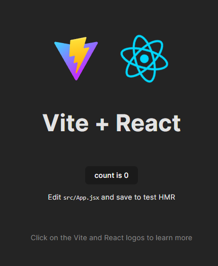

# WDS-React-Basics

##Objective
This is a code-along exercise using this YouTube Video as a template:
https://www.youtube.com/watch?v=Rh3tobg7hEo

The objective is to learn about the fundamental of React by coding along and referencing [React Docs](https://legacy.reactjs.org/docs/getting-started.html) along the way to solidify understanding in React.

##Create project
Run npm create vite@latest
-> React
->Javascript + SWC
npm i

npm run dev

